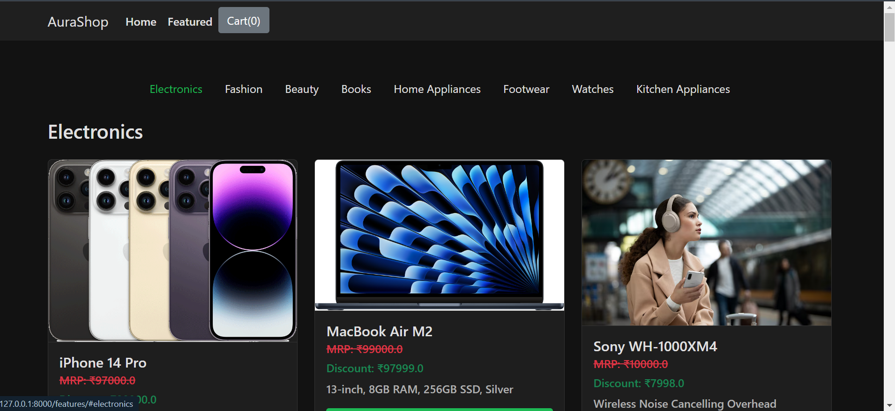

# AuraShop

AuraShop is a modern eCommerce web application built with Django. It provides users with an intuitive interface to browse and purchase products, manage their shopping cart, and complete checkout securely. The application features a dark theme and is designed for a seamless shopping experience.

## Table of Contents

- [Features](#features)
- [Technologies Used](#technologies-used)
- [Installation](#installation)
- [Usage](#usage)
- [Screenshots](#screenshots)
- [Demo Video](#demo-video)
- [Contributing](#contributing)
- [License](#license)
- [Contact](#contact)

## Features

- **Product Browsing:** Users can browse products by category or search for specific items.
- **Shopping Cart:** Add items to the cart, view cart contents, and update quantities.
- **Checkout:** Complete the checkout process by providing shipping details.
- **Dark Theme:** Modern and visually appealing dark theme.
- **Responsive Design:** Fully responsive and works on all devices.
- **Smooth Animations:** Seamless transitions and hover effects.

## Technologies Used

- **Frontend:**
  - HTML
  - CSS (Bootstrap)
  - JavaScript (jQuery)
- **Backend:**
  - Django
- **Database:**
  - SQLite (default, can be switched to other databases)

## Installation

1. Clone the repository:
    ```bash
    git clone https://github.com/AtharvaDeokar21/Ecom.git
    cd ecomsite
    ```

2. Create a virtual environment:
    ```bash
    python -m venv venv
    ```

3. Activate the virtual environment:
    ```bash
    # On Windows
    venv\Scripts\activate

    # On macOS/Linux
    source venv/bin/activate
    ```

4. Install the dependencies:
    ```bash
    pip install -r requirements.txt
    ```

5. Apply migrations:
    ```bash
    python manage.py migrate
    ```

6. Create a superuser to access the admin panel:
    ```bash
    python manage.py createsuperuser
    ```

7. Run the development server:
    ```bash
    python manage.py runserver
    ```

8. Open your web browser and go to `http://127.0.0.1:8000` to see the application.

## Usage

- **Browsing Products:** Navigate to the homepage to browse products. Use the search bar to find specific items.
- **Adding to Cart:** Click on "Add to cart" to add items to your shopping cart.
- **Checkout:** Click on the cart icon and proceed to checkout. Fill in the required details and place your order.
- **Admin Panel:** Access the admin panel at `http://127.0.0.1:8000/admin` to manage products, orders, and users.

## Screenshots


*Home Page*


*Product Page*


*Cart Page*


*Checkout Page*


*Thankyou Page*


*Admin Page*

## Demo Video

Watch the demo video [https://www.loom.com/share/5295cf87cb4a46d0bcbac5624cf65873?sid=e99d50ad-e671-402e-88dc-7ddfc468566e].

## Contributing

Contributions are welcome! Please follow these steps:

1. Fork the repository.
2. Create a new branch: `git checkout -b feature-branch-name`
3. Make your changes and commit them: `git commit -m 'Add some feature'`
4. Push to the branch: `git push origin feature-branch-name`
5. Open a pull request.

## License

This project is licensed under the MIT License. See the [LICENSE](LICENSE) file for more details.

## Contact

For any inquiries, please contact me at:

- **Email:** atharva.deokar2005@gmail.com
- **LinkedIn:** [Atharva Deokar](www.linkedin.com/in/atharva-deokar-70643628b)
- **GitHub:** [Atharva Deokar](https://github.com/AtharvaDeokar21)
